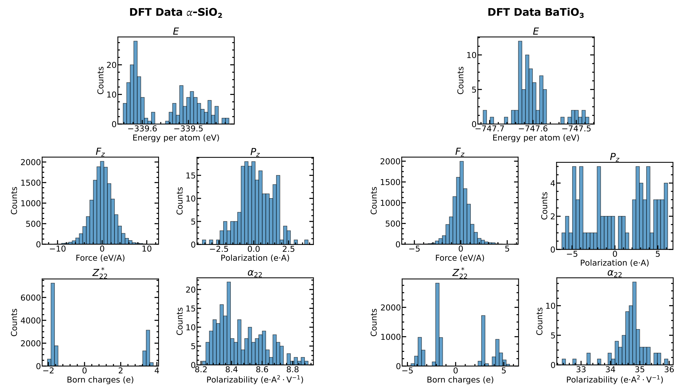

## Parse QE XML files

The `parse_QE.py` script allows pre-processing of QuantumEspresso (QE) XML files to generate extxyz input data for Allegro-pol, where all quantities are expressed in eV units. It is important to ensure consistent units among all physical quantities involved when utilizing our differentiable learning model.

For a given frame, QE calculations are performed in the absence of an electric field and in the presence of a small electric field along either the x, y, or z axes. See the script `generator_QE.py` for a detailed explanation of the folder convention and how to automatically generate folders following the convention required by this script. Additional guidelines for the nomenclature of QE folders are provided in the header of `parse_QE.py`.

We provide examples for SiO₂ and BaTiO₃ (see `generator_QE.py` for additional info). The full QE dataset can be found in the Materials Cloud folder related to this work. Make sure to download the full dataset before running `parse_QE.py` to obtain the complete extxyz. Here, we provide the complete extxyz dataset for both SiO₂ and BaTiO₃, along with histogram plots of energy, forces, polarization, Born charges, and polarizability corresponding to the extxyz files.

