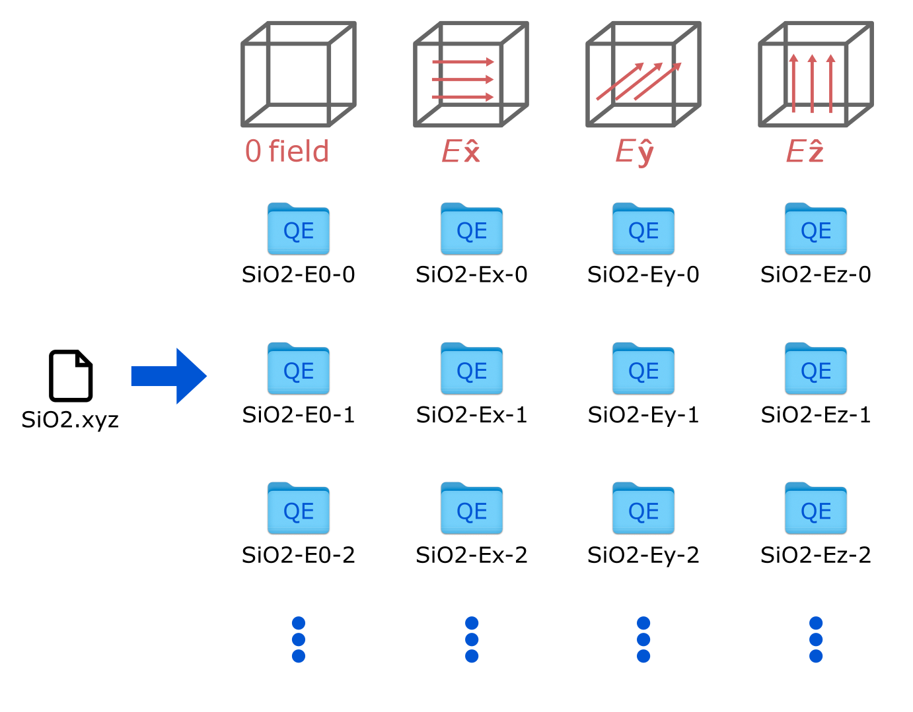

## Calculator for QuantumEspresso 

This script generates input files for performing QE calculations for multiple trajectory files under zero electric field and small finite electric fields along the x, y, and z axes. The trajectory files must be in extxyz format. This convention is then interfaced with the script `parse_QE.py` for parsing the outputs and generating the dataset.

We provide the following examples:

- **SiO₂**: Trajectories obtained with classical MD at T = 300 K (`SiO2-T300.xyz`) and at T = 600 K (`SiO2-T600.xyz`).
- **BaTiO₃**: Trajectories obtained with Flare active learning, starting from the pristine initial configuration (`BaTiO3.xyz`) and from the domain wall structure (`BaTiO3-wall.xyz`).

