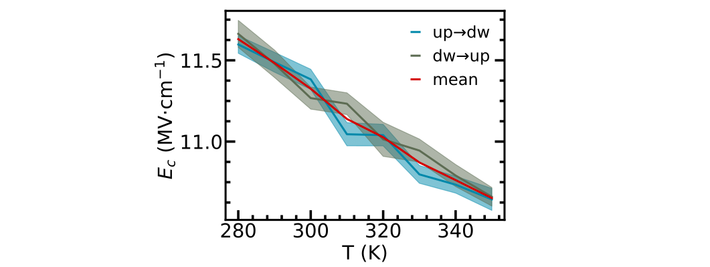

## Coercive Electric Field

This script plots the coercive electric field versus temperature using LAMMPS output files containing polarization hysteresis at different temperatures. The calculations are performed with the pair-Allegro interface, which includes the treatment of polarization, Born charges, and polarizability.

We provide an example for BaTiO₃ (T = 280 K, ..., 350 K). The full dataset can be found in the Materials Cloud folder related to this work.

