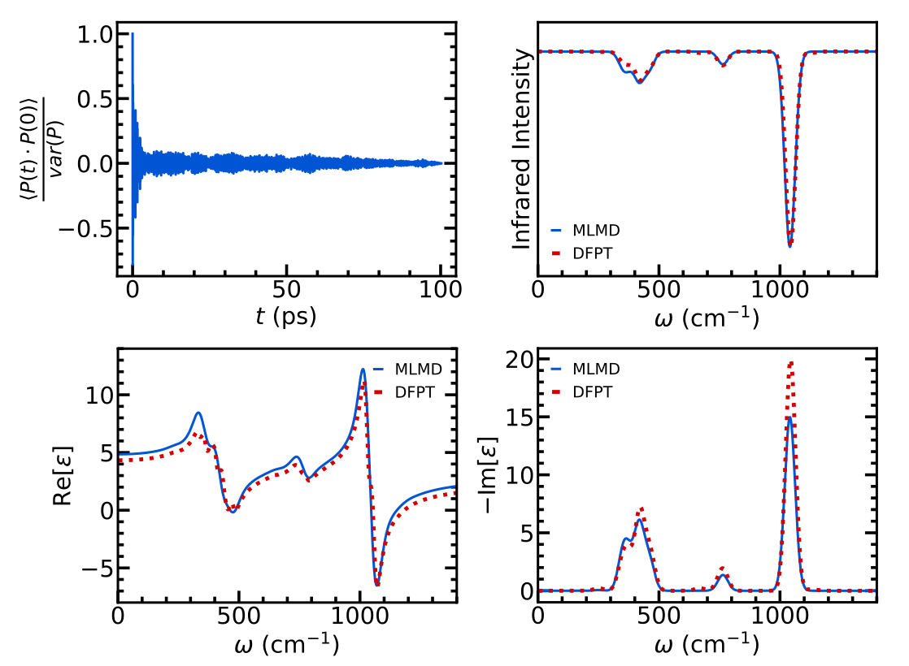

## Vibrational and Fielectric Response from MLMD

This script determines the infrared spectrum and the frequency-dependent dielectric constant from MLMD at a fixed temperature and fixed volume, using the Allegro-pol model.

We provide an example of SiO₂ and show the agreement with DFPT results obtained using Quantum Espresso. The DFPT results can be omitted, as explained in the Python script. For this example, the LAMMPS MD of SiO₂ is carried out up to 100 ps. The full trajectory can be found in the Materials Cloud folder related to this work.

